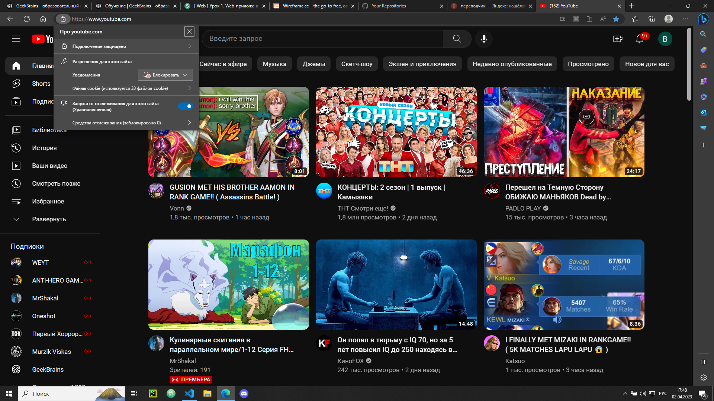
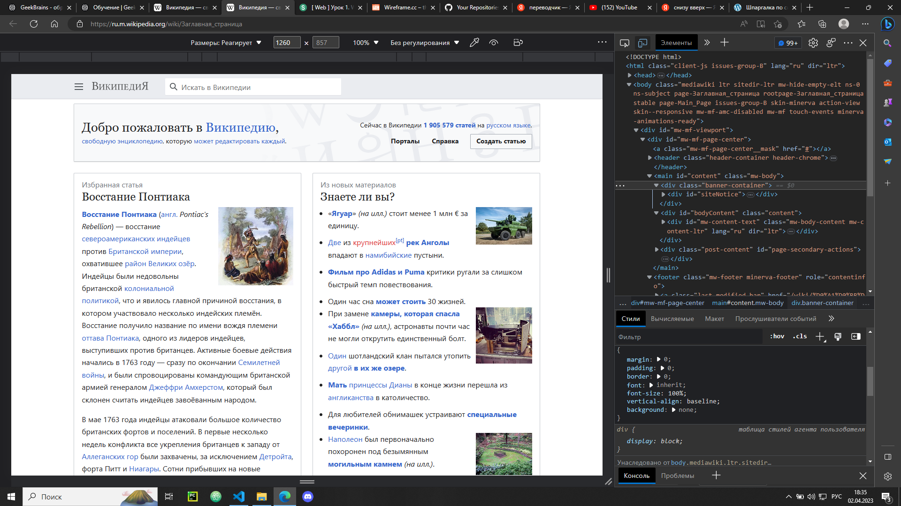
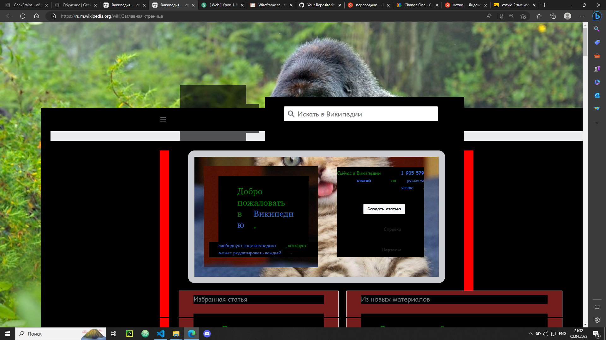
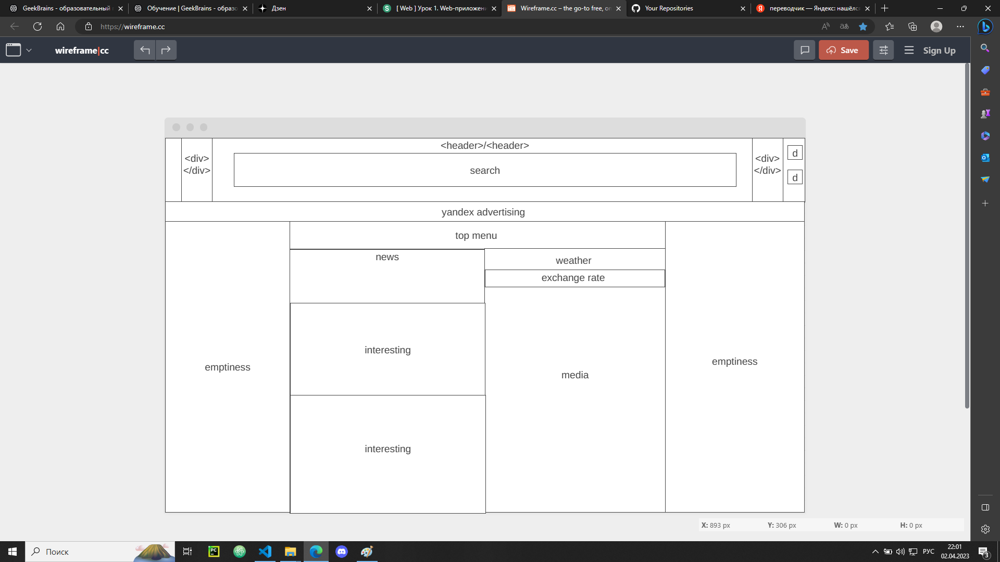

# Определите, на каком протоколе работает сайт youtube.com.

## __Проток посмотрел 2 способами__
1. https://
2. был виден замок
# Создайте файл 2_analyze.txt, в котором проанализируйте структуру страницы сайта https://ru.wikipedia.org/

## Задача для разработчиков!!!
### Создайте сайт:
1. где header будет с логой и поисковым полем. Идущий по всей ширене экрана
2. В main сделайте основной контейнер которой будет содержать наш content. main content сделать централизованным.
   + банер приветствия, под header
   + боковую понель, разделить на участки (Огловление - текст)
   + дальше пойдёт основной content, он будет 2 ряда. Снизу, вверх.
   + в рядах будет информация с гиперсилками на другие страницами нашего сайта.(По ключевым словам разумеется).
   + чтобы сайт не был скучним добавьте вв блоки поля для добавление изображений с краю
   + последним атрибутом контейнера должно быть пространство для рекламы наших проектов, в виде мини-изображений и текстовых-гиперссылок
   + В низу блока content сделайте поле с выбором языка для пользователя
3. В footer оставьте немного место для информации для пользователя. Там будут гиперссылки для пользователя

# Внесите не менее 10 изменений на страницу любой статьи сайта https://ru.wikipedia.org/, с помощью инструмента разработчика
+ Было 
+ Стало 

## ЧТО Я СДЕЛАЛ!
В своих познаниях был приисполнен и сделал сие чудо.
+ поставил задник главный
+ настроил его на весль экран, без повторений
+ поменял цет шрифта
+ поменял жирность шрифта
+ поставил новый шрифт 
    + font-family: 'Changa One', cursive;
+ поменял margin и padding
+ поменял бек основного контента
+ поменял бэк в нутри объектов основного контента
+ поставил котика на банер
+ добавил рамку и скруглил ёё    

# Создайте прототип низкой детализации сайта https://dzen.ru/ с помощью сайта https://wireframe.cc/.
